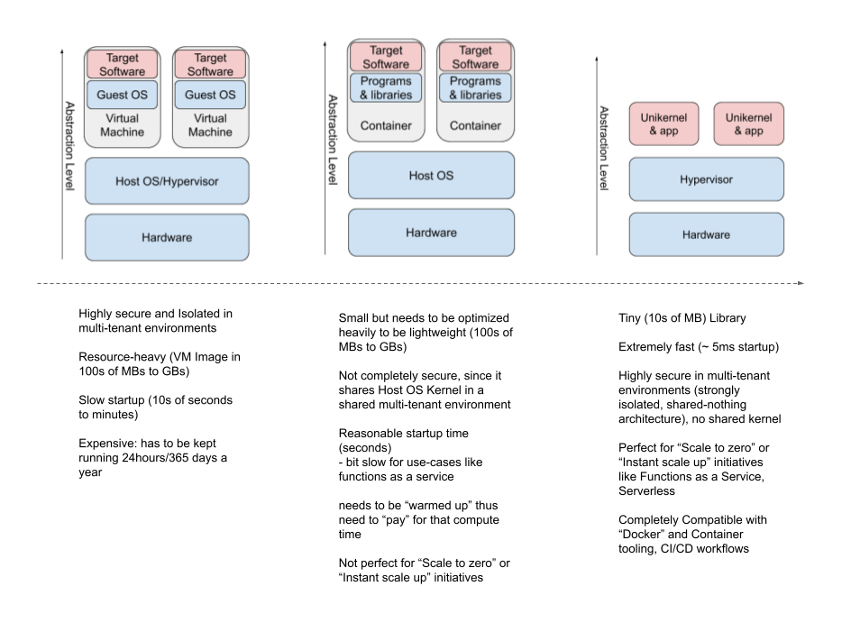

# Introduction

[Kontain](https://kontain.app) was founded on the insight that 2013-era containers are far too insecure, slow, and bloated for the demands of the 2020s as explained here.

Fully integrated with Docker and Kubernetes with a OCI and CRI compliant approach, and requiring no changes to source code, CI, or DevOps tooling, Kontain simply delivers strongly isolated containers with fortress-strong security isolation, thousands of times faster startup, and vastly smaller footprint.

To use Kontain, view the [guide](/gettingstarted/install)

A new approach to Containers but fully integrated with Docker and Kubernetes.
With the current ongoing tectonic shift to cloud-based shared tenant, microservice based architectures, where containers, VMs all run on shared cloud hardware, it is time that these microservices are packaged into strongly isolated, secure, specialized packages that only includes the application code and just the required OS code and nothing more to run fast and securely on the shared multi-tenant cloud hardware with strong isolation.  It almost literally packages and employs only the functions needed to make an application work, and nothing more.

This sort of packaging into a minimalistic unikernel image allows the application to leverage a Single Address Space, Single Process model and  run at screaming speeds.  There is no context switching, so the Application almost runs at the speed of the host Operating system.  Some more advantages are outlined here.  This enables it to be secure by nature since they do not share a kernel and present a minimal to no attack surface at the OS level.

A unikernel is a single-address-space machine image that contains an application workload—the program you want to run in a container—combined with a minimal set of library functions which provide the OS services required to run the workload.  This approach comes with a ton of advantages in terms of:
Security - highly secure, isolated, minimal attack surface packages in multi-tenant environments
Shared-nothing architecture with very high density
Speed - almost instantaneous startup time (in milliseconds rather than seconds)
Resource consumption reduced by orders of magnitude - compute and size
Really Immutable packages of code

This Docker workflow/tools compatible approach offers huge advantages in the following areas:
* For packaging microservices in minimalistic, fast, secure containers
* Functions as a service without the security, startup downsides
Scale to zero with instantaneous startup time
* IOT where security, speed, resource size are critical
* Edge computing
* Anyplace where security, speed, cost and resource constraints are a high priority
